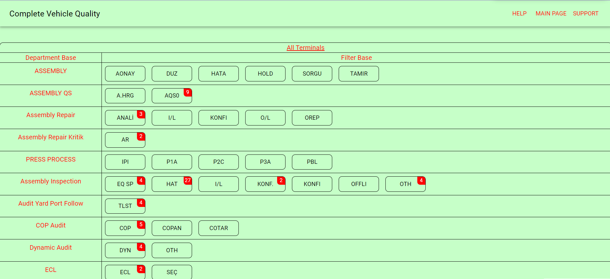
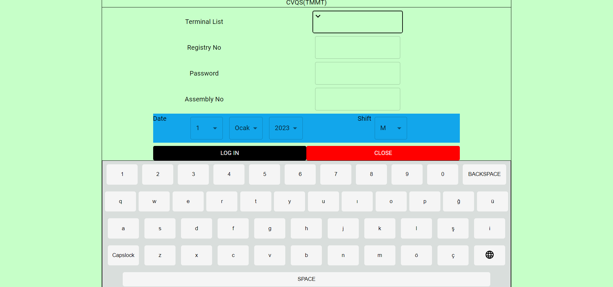
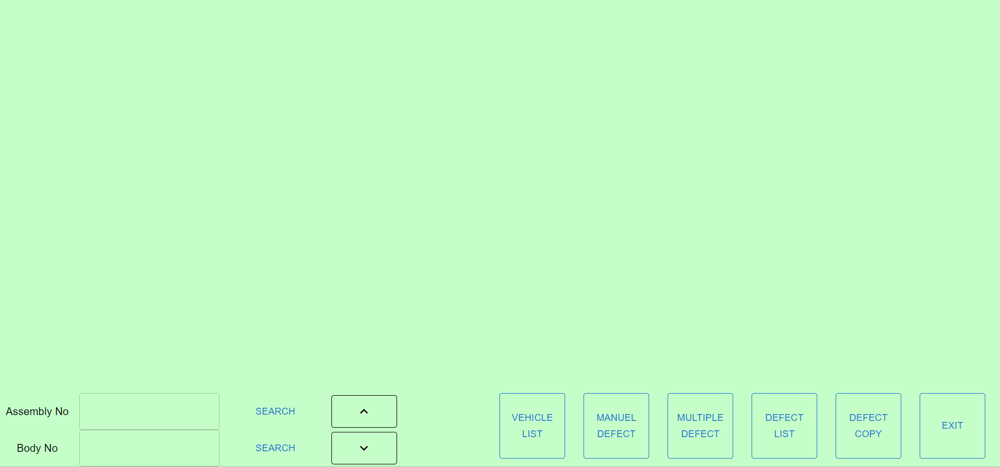

<div align="center" id="top"> 
  

  &#xa0;

  <!-- <a href="https://toyotaproject.netlify.app">Demo</a> -->
</div>

<h1 align="center">Toyota Project</h1>


<!-- Status -->

<!-- <h4 align="center"> 
	🚧  Toyota Project 🚀 Under construction...  🚧
</h4> 

<hr> -->

<p align="center">
  <a href="#dart-about">About</a> &#xa0; | &#xa0; 
  <a href="#rocket-technologies">Technologies</a> &#xa0; | &#xa0;
  <a href="#rocket-technologies">Media</a> &#xa0; | &#xa0;
  <a href="#white_check_mark-requirements">Requirements</a> &#xa0; | &#xa0;
  <a href="#checkered_flag-starting">Starting</a> &#xa0; | &#xa0;
 <a href="#checkered_flag-starting">Supported Languages</a> &#xa0; | &#xa0;
</p>

<br>

## :dart: About ##

This project is a front-end project that has created to add and list the defects of vehicles produced at the Toyota vehicle manufacturing factory.

## Media
### Terminal page 
### Login Page 
### Defect Register Screen 
### Defect Listing 


## :rocket: Technologies ##

The following tools were used in this project:

- [React.js-18.2.0]
- [react-redux-8.0.5]
- [react-dom-18.2.0]
- [react-router-dom-6.9.0]
- [Node.js]
- [i18next-22.4.15]
- [Axios-1.3.4]


## :white_check_mark: Requirements ##

Before starting :checkered_flag:, you need to have [Git](https://git-scm.com) and [Node](https://nodejs.org/en/) installed.

## :checkered_flag: Starting ##

```bash
# Clone this project
$ git clone https://github.com/{{gizemsangur1}}/toyota-project

# Access
$ cd toyota-project

# Install dependencies
$ yarn

# Run the project
$ yarn start

# The server will initialize in the <http://localhost:3000>
```
## :checkered_flag: Suppported Languages ##
Türkçe \
English \
Deutsch \
Français \
Русский 

<a href="#top">Back to top</a>
